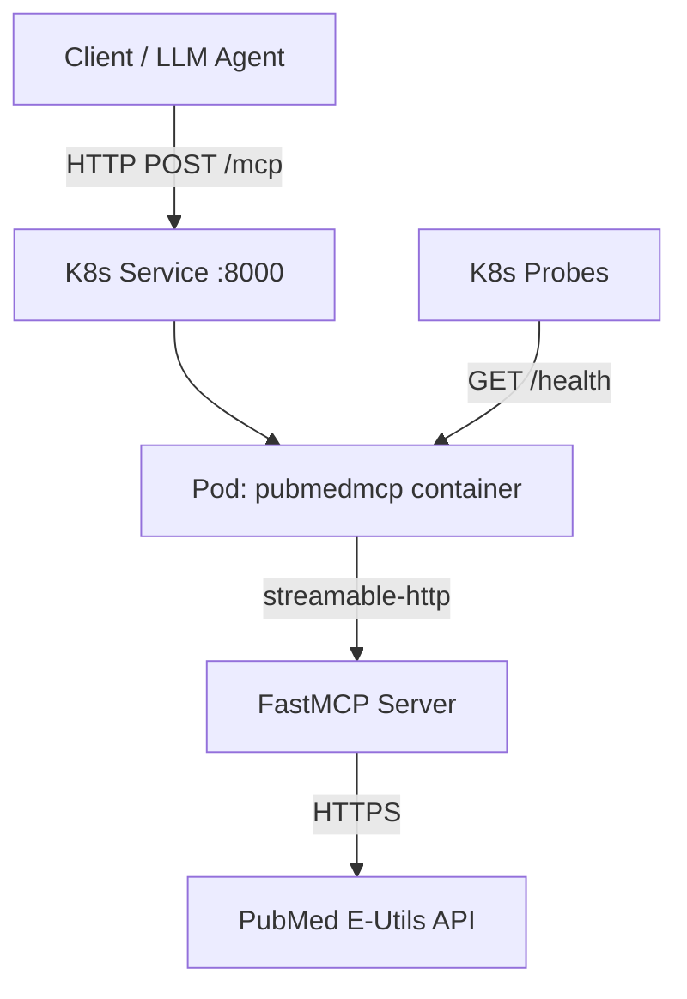

# Plan: Dockerize PubMed MCP Server for Kubernetes

## Overview

Containerize the PubMed MCP server for deployment to Kubernetes using `streamable-http` transport. The current server runs via `stdio` transport (suitable for local Claude Desktop usage). We need to add HTTP transport support so it can run as a network-accessible service in K8s.

## Architecture



## Key Decisions

| Decision | Choice | Rationale |
|----------|--------|-----------|
| Transport | `streamable-http` | Recommended for production by MCP SDK; stateless, scalable |
| Base image | `python:3.12-slim` | Matches `.python-version`; slim for smaller image size |
| Package manager | `uv` in build stage | Matches project tooling; fast dependency resolution |
| Build strategy | Multi-stage | Keeps final image small by excluding build tools |
| Health check | Custom `/health` endpoint | K8s liveness/readiness probes need an HTTP endpoint |
| Config | Environment variables | `TRANSPORT`, `HOST`, `PORT` for flexibility between local and K8s |

## Changes Required

### 1. Modify [`__main__.py`](src/pubmedmcp/__main__.py)

- Add environment variable support for transport selection:
  - `TRANSPORT` — `stdio` (default) or `streamable-http`
  - `HOST` — bind address (default `0.0.0.0`)
  - `PORT` — listen port (default `8000`)
- Configure `FastMCP` with `stateless_http=True` and `json_response=True` when using streamable-http (enables horizontal scaling — no session affinity needed)
- The `main()` function becomes:

```python
import os

def main():
    transport = os.environ.get("TRANSPORT", "stdio")
    if transport == "streamable-http":
        host = os.environ.get("HOST", "0.0.0.0")
        port = int(os.environ.get("PORT", "8000"))
        mcp.run(
            transport="streamable-http",
            host=host,
            port=port,
            stateless_http=True,
            json_response=True,
        )
    else:
        mcp.run(transport="stdio")
```

- **Backward compatible**: Default transport stays `stdio`, so local Claude Desktop usage is unaffected.

### 2. Add Health Check Endpoint

Add a `/health` endpoint on the same port for K8s probes. The MCP SDK runs on Starlette/Uvicorn under the hood, so we can mount a simple health route. The simplest approach is to use a custom Starlette app that mounts both the MCP streamable-http app and a health endpoint:

```python
# Only needed when running in streamable-http mode
from starlette.applications import Starlette
from starlette.routing import Route, Mount
from starlette.responses import JSONResponse

async def health(request):
    return JSONResponse({"status": "ok"})
```

### 3. Create `Dockerfile`

Multi-stage build using `uv` for dependency installation:

```dockerfile
# Stage 1: Build
FROM python:3.12-slim AS builder
COPY --from=ghcr.io/astral-sh/uv:latest /uv /usr/local/bin/uv
WORKDIR /app
COPY pyproject.toml uv.lock ./
COPY src/ ./src/
RUN uv sync --frozen --no-dev

# Stage 2: Runtime
FROM python:3.12-slim
WORKDIR /app
COPY --from=builder /app/.venv /app/.venv
ENV PATH="/app/.venv/bin:$PATH"
ENV TRANSPORT=streamable-http
ENV HOST=0.0.0.0
ENV PORT=8000
EXPOSE 8000
CMD ["pubmedmcp"]
```

### 4. Create `.dockerignore`

```
.venv
__pycache__
*.pyc
.git
.github
.pre-commit-config.yaml
dist/
build/
*.egg-info
plans/
```

### 5. Create K8s Manifests — `k8s/deployment.yaml`

```yaml
apiVersion: apps/v1
kind: Deployment
metadata:
  name: pubmedmcp
  labels:
    app: pubmedmcp
spec:
  replicas: 2
  selector:
    matchLabels:
      app: pubmedmcp
  template:
    metadata:
      labels:
        app: pubmedmcp
    spec:
      containers:
        - name: pubmedmcp
          image: pubmedmcp:latest  # Replace with your registry
          ports:
            - containerPort: 8000
          env:
            - name: TRANSPORT
              value: streamable-http
          livenessProbe:
            httpGet:
              path: /health
              port: 8000
            initialDelaySeconds: 5
            periodSeconds: 10
          readinessProbe:
            httpGet:
              path: /health
              port: 8000
            initialDelaySeconds: 3
            periodSeconds: 5
          resources:
            requests:
              memory: 128Mi
              cpu: 100m
            limits:
              memory: 256Mi
              cpu: 500m
```

### 6. Create K8s Manifests — `k8s/service.yaml`

```yaml
apiVersion: v1
kind: Service
metadata:
  name: pubmedmcp
spec:
  selector:
    app: pubmedmcp
  ports:
    - protocol: TCP
      port: 80
      targetPort: 8000
  type: ClusterIP
```

### 7. Update [`README.md`](README.md)

Add a Docker/K8s deployment section documenting:
- How to build the image
- How to run locally with Docker
- How to deploy to K8s
- Environment variable reference

## File Tree After Changes

```
pubmedmcp/
├── .dockerignore          # NEW
├── .gitignore
├── Dockerfile             # NEW
├── pyproject.toml
├── README.md              # MODIFIED - add Docker/K8s section
├── src/
│   └── pubmedmcp/
│       ├── __init__.py
│       └── __main__.py    # MODIFIED - add transport config + health check
├── k8s/                   # NEW directory
│   ├── deployment.yaml
│   └── service.yaml
└── ...
```

## Scalability Notes

- **Stateless mode** (`stateless_http=True`): No session affinity required. Each request is independent, allowing K8s to load-balance freely across replicas.
- **JSON response** (`json_response=True`): Returns JSON instead of SSE streams — simpler for load balancers and proxies.
- **Horizontal scaling**: Safe to run multiple replicas since there is no shared state. The server is a pure proxy to the PubMed E-Utils API.
